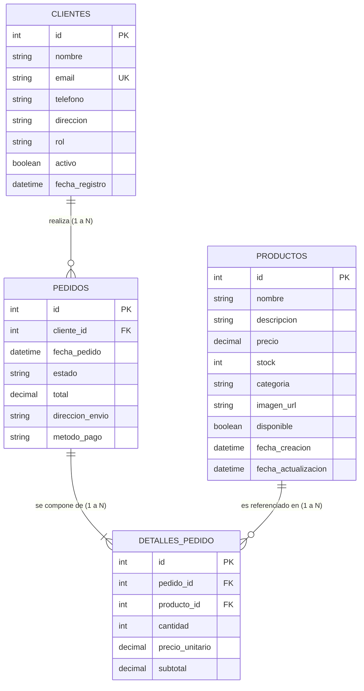

# 🥐 ESPECIFICACIÓN TÉCNICA Y FUNCIONAL PARA REPLICACIÓN
## Sistema de Comercio Electrónico y Gestión para Panadería Artesanal "Pan de Casa"

> **Propósito de este documento:**  
> Este informe constituye la **fuente de verdad absoluta (Blueprint agnóstico de tecnología)** para recrear exactamente el mismo aplicativo en cualquier lenguaje, framework o plataforma (Node.js/Express/Nest, Python/Django/FastAPI, C#/.NET Core, PHP/Laravel, Go, React, Vue, Angular, Flutter, etc.). Se omiten deliberadamente configuraciones o dependencias del software original para centrarse al 100% en el **diseño, arquitectura de datos, comportamiento del frontend, contratos de API y reglas del negocio**.

---

## 1. 💼 VISIÓN GENERAL Y MODELO DE NEGOCIO

### 1.1 Naturaleza y Propósito
El aplicativo es una plataforma e-commerce y operativa para una panadería artesanal que:
1. Permite a los clientes consultar productos frescos horneados diariamente, añadirlos a un carrito interactivo, ordenar en línea sin barreras de registro y rastrear el avance de su pedido en tiempo real mediante un código único.
2. Provee al personal de la panadería una consola administrativa para controlar inventario, modificar precios/fotos, supervisar el flujo de órdenes en cocina y despacho, y conocer la producción requerida para hornear.

### 1.2 Reglas Comerciales Generales
* **Moneda del Sistema:** Peso Colombiano (`COP`), presentado sin decimales con separador de miles por punto (ej. `$ 3.500`, `$ 12.000`).
* **Zonas Horarias:** Registro de fechas en formato ISO-8601 o fecha local (`YYYY-MM-DD HH:mm:ss`).
* **Modalidad de Pedido:** Entrega a domicilio con pago en efectivo o contraentrega / transferencia local (Nequi, Daviplata, Tarjeta).

### 1.3 Actores del Sistema
* **Cliente:** Navega por la tienda, añade productos, procesa compras y rastrea órdenes.
* **Administrador (Personal / Cocina):** Gestiona productos, visualiza estadísticas y actualiza estados de despacho.

---

## 2. 🎨 SISTEMA DE DISEÑO, COLORES Y PRESENTACIÓN VISUAL

El diseño proyecta una estética artesanal cálida, limpia y premium, combinando tonos tierra y terracota con superficies translúcidas (*Glassmorphism*).

### 2.1 Paleta Cromática Base

| Nombre del Token | Valor Hexadecimal / RGBA | Uso en el Sistema |
| :--- | :--- | :--- |
| **Color Primario** | `#e76e55` | Color de marca (Terracota cálido). Botones principales, acentos activos, badges, línea de progreso y enlaces activos. |
| **Color Primario Hover** | `#d65a41` | Tono más intenso para interacción hover en botones y enlaces. |
| **Fondo General** | `#f7f9fc` | Gris azulado ultra suave para evitar la fatiga visual. |
| **Superficie Translúcida** | `rgba(255, 255, 255, 0.85)` | Fondo con efecto *Glassmorphism* para el menú superior con `backdrop-filter: blur(12px)`. |
| **Superficie Sólida** | `#ffffff` | Fondo blanco puro para tarjetas, formularios y modales. |
| **Texto Principal** | `#1e293b` | Slate 800 de alto contraste para encabezados (`h1`-`h6`) y textos clave. |
| **Texto Secundario** | `#64748b` | Slate 500 para descripciones, subtítulos, placeholders y metadatos. |
| **Color de Bordes** | `rgba(226, 232, 240, 0.8)` | Separadores sutiles, bordes de tarjetas e inputs. |

### 2.2 Paleta Semántica para Estados de Órdenes (Chips / Badges)

| Estado de la Orden | Color de Fondo (Pastel) | Color del Texto (Oscuro) | Significado Visual |
| :--- | :--- | :--- | :--- |
| **`PENDIENTE`** | `#fef3c7` (Ámbar claro) | `#d97706` (Ámbar intenso) | Orden recibida en espera de atención. |
| **`EN_PREPARACION`** | `#dbeafe` (Azul claro) | `#1d4ed8` (Azul rey) | Los panaderos están horneando o empacando. |
| **`ENVIADO`** | `#e0e7ff` (Índigo suave) | `#4338ca` (Índigo oscuro) | El domiciliario va en camino. |
| **`ENTREGADO`** | `#dcfce7` (Menta suave) | `#15803d` (Verde esmeralda) | Pedido entregado satisfactoriamente. |
| **`CANCELADO`** | `#fee2e2` (Rojo claro) | `#b91c1c` (Rojo oscuro) | Orden anulada por stock o cliente. |

### 2.3 Tipografía y Jerarquía
* **Familia Tipográfica:** `'Work Sans', system-ui, -apple-system, sans-serif`.
* **Títulos de Impacto (Hero):** Tamaño grande (`4rem` en escritorio, `2.5rem` en móviles). Gradiente de texto: `linear-gradient(to right, #1e293b, #e76e55)` con máscara de recorte.
* **Títulos de Tarjetas (`h3`):** `1.15rem` a `1.25rem`, peso `700`.
* **Precios:** Peso `700`, tamaño destacado (`1.2rem` a `1.3rem`).

### 2.4 Geometría, Sombras y Micro-animaciones
* **Bordes Redondeados:**
  * Tarjetas y contenedores: `16px`.
  * Botones e inputs: `8px`.
  * Chips de estado, botones circulares e iconos: `9999px` o `50%`.
* **Elevaciones (Sombras):**
  * Sombra base de tarjetas: `0 4px 6px -1px rgba(0, 0, 0, 0.05)`.
  * Sombra al pasar el cursor (Hover): `0 10px 15px -3px rgba(0, 0, 0, 0.05)` con elevación física `transform: translateY(-4px)`.
  * Sombra botón primario: `0 4px 12px rgba(231, 110, 85, 0.3)`.
* **Animación de Entrada de Páginas:**
  ```css
  @keyframes fade-in-up {
    from { opacity: 0; transform: translateY(20px); }
    to { opacity: 1; transform: translateY(0); }
  }
  /* Duración: 0.6s cubic-bezier(0.16, 1, 0.3, 1) */
  ```

---

## 3. 🖥️ MAPA DE PÁGINAS Y VISTAS DEL FRONTEND

El sistema cuenta con **9 páginas independientes** organizadas en dos secciones (Cliente y Administración) más componentes globales compartidos.

```
PÁGINAS PÚBLICAS (CLIENTE)
├── /                ──> 1. Catálogo Principal de Productos
├── /cart            ──> 2. Carrito de Compras
├── /checkout        ──> 3. Finalización de Compra (Checkout)
├── /order-status    ──> 4. Consulta y Rastreo de Pedido
└── /admin           ──> 5. Inicio de Sesión Administrativo

PÁGINAS PROTEGIDAS (ADMINISTRACIÓN)
├── /admin/dashboard ──> 6. Panel de Control y Métricas
├── /admin/products  ──> 7. Gestión CRUD de Productos (con Modal)
├── /admin/orders    ──> 8. Gestión de Pedidos Activos y Estados
└── /admin/password  ──> 9. Actualización de Contraseña
```

---

### 3.1 Componentes Globales Compartidos

#### A. Barra de Navegación Superior (`Header`)
* **Ubicación:** Visible en todas las pantallas, anclada en la parte superior (`sticky`, altura `72px`).
* **Efecto Visual:** Fondo translúcido con desenfoque (`backdrop-filter: blur(12px)`).
* **Contenido:**
  * **Logo:** Ícono de escudo/seguridad + Texto "Pan de Casa".
  * **Enlaces de Navegación:** "Catálogo" (`/`), "Mis Pedidos" (`/order-status`), "Admin" (`/admin/dashboard`).
  * **Indicador de Enlace Activo:** Línea naranja animada que crece en el borde inferior del enlace activo.
  * **Botón del Carrito:** Ícono de bolsa/carrito en círculo blanco flotante con un globo o insignia (*badge*) naranja que muestra el conteo total numérico de productos en tiempo real. Al hacer clic, navega a `/cart`.

#### B. Barra Lateral de Administración (`AdminSidebar`)
* **Ubicación:** Visible en todas las páginas `/admin/*` (a la izquierda en escritorio, superior en móviles).
* **Contenido:**
  * Título: "Admin Panel".
  * Enlaces de navegación con resaltado activo:
    * "Dashboard" (`/admin/dashboard`)
    * "Pedidos Activos" (`/admin/orders`)
    * "Gestión de Catálogo" (`/admin/products`)
    * "Contraseña de Administrador" (`/admin/password`)
  * Botón inferior: "Cerrar Sesión" con ícono de salida (redirige a `/`).

#### C. Gestor de Estado del Carrito (Cart Store / Context)
* Persiste los datos en el navegador del cliente (`localStorage` bajo la clave `panDeCasa_cart`).
* Métodos requeridos:
  * `addToCart(producto)`: Añade un producto o suma 1 a la cantidad si ya existe.
  * `updateQuantity(productoId, nuevaCantidad)`: Modifica la cantidad. Si la cantidad es `< 1`, remueve el ítem.
  * `removeFromCart(productoId)`: Elimina el ítem seleccionado.
  * `clearCart()`: Vacía el carrito por completo.
  * `getCartCount()`: Retorna el total de unidades sumadas.
  * `getCartTotal()`: Retorna el valor total monetario a pagar.

---

### 3.2 Detalle de Cada Página

---

#### Página 1: Catálogo de Productos (`/`)
* **Propósito:** Mostrar los productos disponibles al público general.
* **Elementos y Estructura:**
  1. **Sección Hero:** Encabezado con título promocional (*"El sabor de la tradición en cada rebanada"*), subtítulo y fondo degradado cálido.
  2. **Selector de Vista:** Dos botones de íconos alineados a la derecha para alternar entre:
     * **Vista Cuadrícula (Grid):** Tarjetas en filas adaptativas (mínimo `230px` por tarjeta).
     * **Vista Lista (List):** Tarjetas horizontales en filas continuas.
  3. **Listado de Tarjetas de Producto (`ProductCard`):**
     * Imagen del producto con altura fija de `220px` (en caso de error de carga, aplica imagen de respaldo).
     * Nombre del producto (`h3`).
     * Descripción textual.
     * Separador punteado.
     * Precio formateado en Pesos Colombianos.
     * **Botón de Interacción Dinámico:**
       * Si el producto **NO** está en el carrito: Botón *"Agregar"* naranja con ícono de carrito.
       * Si el producto **YA** está en el carrito: Se convierte en un control de cantidad tipo pastilla (*stepper*) con botón `[-]`, número actual y botón `[+]`.
  4. **Estado de Carga:** Indicador circular animado (*spinner*) mientras se consultan los productos.

---

#### Página 2: Carrito de Compras (`/cart`)
* **Propósito:** Revisar los productos seleccionados antes de comprar.
* **Comportamiento si el carrito está vacío:** Muestra un ícono grande de bolsa, el mensaje *"Tu carrito está vacío"* y un botón *"Ir al Catálogo"*.
* **Estructura si tiene productos (Layout de 2 columnas):**
  * **Columna Izquierda (Lista de Ítems):**
    * Tarjeta por cada ítem: Miniatura (`120x120px`), nombre, precio unitario, botón de eliminar (ícono de papelera), selector de cantidad `[-] N [+]` y subtotal del ítem en color terracota.
  * **Columna Derecha (Resumen Sticky):**
    * Subtotal calculado.
    * Fila de envío: Texto *"Calculado en checkout"*.
    * Total consolidado en texto grande y negrita.
    * Botón primario: *"Proceder al Pago"* (navega a `/checkout`).
    * Botón secundario outline: *"Vaciar Carrito"*.

---

#### Página 3: Finalizar Compra (`/checkout`)
* **Propósito:** Recolectar la información del cliente y confirmar el pedido.
* **Comportamiento inicial:** Si el carrito no tiene ítems, redirige automáticamente a `/cart`.
* **Estructura:**
  * **Columna Izquierda (Formulario de Compra):**
    * *Bloque 1: Datos Personales:* Nombre Completo (requerido), Correo Electrónico (requerido, tipo email), Teléfono (requerido).
    * *Bloque 2: Datos de Envío:* Dirección Completa de Entrega (requerido), Notas para el repartidor (opcional, textarea).
    * Botón de envío: *"Confirmar Pedido"* (se desactiva y muestra *"Procesando..."* durante la petición).
  * **Columna Derecha (Resumen Fijo):**
    * Lista de ítems adquiridos con cantidades y precios.
    * Total a pagar destacado.
* **Pantalla de Éxito Post-Compra (Reemplaza la vista):**
  * Ícono de verificación verde grande (`CheckCircle`).
  * Título: *"¡Pedido confirmado!"*.
  * Mensaje de agradecimiento.
  * **Caja de Código de Seguimiento:** Muestra en tipografía monoespaciada grande el código generado: `PED-{id}` (ej. `PED-5`).
  * Botones de acción:
    * *"Rastrear Pedido"* (navega a `/order-status`).
    * *"Volver al Inicio"* (navega a `/`).

---

#### Página 4: Consulta y Rastreo de Pedido (`/order-status`)
* **Propósito:** Permitir a cualquier cliente revisar en qué etapa va su entrega.
* **Estructura:**
  1. **Tarjeta de Búsqueda:**
     * Input de texto para ingresar el código (acepta `PED-5`, `ped-5` o solo `5`).
     * Botón *"Buscar"* con ícono de lupa.
     * Caja de error en color rojo si la orden no existe (HTTP 404) o el código es inválido.
  2. **Resultado de Rastreo (Si se encuentra la orden):**
     * **Línea de Tiempo Visual Interactiva:**
       * Barra horizontal con línea gris de fondo y línea de progreso naranja rellena proporcionalmente según la etapa:
         * **Etapa 1:** Ícono de Reloj ➔ **"Recibido"** (`PENDIENTE`)
         * **Etapa 2:** Ícono de Paquete ➔ **"En Horno"** (`EN_PREPARACION`)
         * **Etapa 3:** Ícono de Camión ➔ **"En Camino"** (`ENVIADO`)
         * **Etapa 4:** Ícono de Check ➔ **"Entregado"** (`ENTREGADO`)
       * Círculos coloreados con borde e ícono cuando la etapa está cumplida.
       * **Caso Cancelado:** Si el estado es `CANCELADO`, reemplaza la línea de tiempo por una tarjeta roja de alerta con el texto *"Pedido Cancelado: Este pedido ha sido anulado por la administración"*.
     * **Tarjeta de Detalles:**
       * Cuadrícula de 2 columnas: Datos de Entrega (Nombre, Dirección, Teléfono) e Información de Pago (Código `PED-X`, Método de pago, Fecha formateada).
       * Lista desglosada de productos adquiridos con sus cantidades y subtotales.
       * Total final pagado.

---

#### Página 5: Inicio de Sesión Administrativo (`/admin`)
* **Propósito:** Autenticar al usuario administrador antes de acceder a la consola.
* **Estructura:**
  * Tarjeta centrada en pantalla.
  * Título: *"Acceso Administrativo"*.
  * Input de contraseña con placeholder explicativo.
  * Botón *"Ingresar"*.
  * Mensaje de error rojo en caso de contraseña incorrecta.

---

#### Página 6: Dashboard de Métricas y Producción (`/admin/dashboard`)
* **Propósito:** Visión general del rendimiento diario y requerimientos de horneado.
* **Estructura:**
  * **Fila de Métricas (3 Tarjetas KPI):**
    1. *Ventas Totales:* Suma en pesos de todos los pedidos históricos, ícono de signo pesos sobre fondo terracota suave.
    2. *Pedidos Totales:* Conteo absoluto de pedidos registrados, ícono de bolsa sobre fondo azul claro.
    3. *Pendientes Envío:* Conteo de pedidos en estado `PENDIENTE`, ícono de paquete sobre fondo ámbar.
  * **Tabla de Reporte de Producción ("A Hornear"):**
    * Consolida los productos que deben producirse en la cocina según los pedidos activos pendientes.
    * Columnas: *Producto* (nombre) y *Cantidad Requerida* (número resaltado en color primario).

---

#### Página 7: Gestión de Catálogo (`/admin/products`)
* **Propósito:** Crear, editar y dar de baja productos de la tienda.
* **Estructura:**
  * Barra superior: Título *"Catálogo de Productos"* y botón primario *"Nuevo Producto"* con ícono `+`.
  * **Grilla de Tarjetas de Producto Administrativas:**
    * Cada tarjeta muestra: Miniatura de la imagen, nombre, precio, botón *"Editar"* (abre modal) y botón rojo *"X"* para eliminar (con confirmación de navegador `confirm`).
  * **Modal Emergente (Agregar / Editar Producto):**
    * Fondo oscuro semitransparente con desenfoque (`backdrop-filter: blur(4px)`).
    * Título dinámico: *"Nuevo Producto"* o *"Editar Producto"*.
    * Campos del formulario:
      * Nombre del producto (texto, requerido).
      * Precio en COP (número, requerido, min 1).
      * URL de la imagen (texto con previsualización en vivo en miniatura cuadrada adyacente).
      * Descripción (área de texto, requerida).
    * Botones inferiores: *"Cancelar"* y *"Guardar Cambios"*.

---

#### Página 8: Gestión de Pedidos Activos (`/admin/orders`)
* **Propósito:** Control operativo y cambio de estado de los pedidos de los clientes.
* **Estructura:**
  * Lista vertical de tarjetas de pedidos ordenadas de **más reciente a más antigua**.
  * Cada tarjeta de pedido contiene:
    * **Lado Izquierdo:**
      * Número de pedido (`Pedido #ID`).
      * Datos del cliente: Nombre y Teléfono.
      * Dirección de entrega.
      * Fecha y hora formateadas.
      * Lista de productos solicitados con sus cantidades (ej. `2x Pan Canilla Artesanal`).
    * **Lado Derecho:**
      * Total de la orden en moneda formateada.
      * **Badge Coloreado del Estado Actual:** Aplica los colores de la paleta semántica (`PENDIENTE`, `EN_PREPARACION`, etc.).
      * **Selector Desplegable (`<select>`):** Permite cambiar el estado directamente entre: *Pendiente, En Preparación, Enviado, Entregado, Cancelado*. Al cambiar una opción, se actualiza el estado inmediatamente en el backend y se dispara la notificación al cliente.

---

#### Página 9: Cambio de Contraseña (`/admin/password`)
* **Propósito:** Permitir al administrador actualizar su clave de acceso.
* **Estructura:**
  * Formulario con 2 campos: *Nueva Contraseña* y *Confirmar Contraseña*.
  * Botón *"Actualizar Contraseña"*.
  * Alertas en pantalla: Verde si coinciden y se actualiza con éxito, roja si las claves no coinciden.

---

## 4. 🗄️ MODELO DE DATOS BACKEND (ESTRUCTURA RELACIONAL)

El sistema opera sobre **4 entidades relacionales principales**.



### 4.1 Especificación de Tablas y Campos

#### 1. `productos`
* `id` (Entero, Clave Primaria, Autoincremental).
* `nombre` (Texto, máx 100 caracteres, Obligatorio).
* `descripcion` (Texto, máx 255 caracteres, Opcional).
* `precio` (Decimal / Flotante, Obligatorio, Valor mínimo: 0).
* `stock` (Entero, Obligatorio, Valor mínimo: 0).
* `categoria` (Texto, máx 50 caracteres, Obligatorio; ej. "Panes", "Amasijos", "Repostería").
* `imagen_url` (Texto, máx 255 caracteres, Opcional).
* `disponible` (Booleano, Obligatorio, Valor por defecto: `true`).
* `fecha_creacion` (Timestamp, asignado automáticamente al crear).
* `fecha_actualizacion` (Timestamp, actualizado automáticamente al editar).

#### 2. `clientes`
* `id` (Entero, Clave Primaria, Autoincremental).
* `nombre` (Texto, máx 100 caracteres, Obligatorio).
* `email` (Texto, máx 100 caracteres, Obligatorio, **ÚNICO**).
* `telefono` (Texto, máx 20 caracteres, Opcional).
* `direccion` (Texto, máx 200 caracteres, Opcional).
* `rol` (Texto, máx 20 caracteres, Obligatorio, Valores: `'CLIENTE'` o `'ADMIN'`).
* `activo` (Booleano, Obligatorio, Valor por defecto: `true`).
* `fecha_registro` (Timestamp, asignado automáticamente).

#### 3. `pedidos`
* `id` (Entero, Clave Primaria, Autoincremental).
* `cliente_id` (Entero, Clave Foránea referenciando a `clientes.id`, Obligatorio).
* `fecha_pedido` (Timestamp, asignado automáticamente al ordenar).
* `estado` (Texto, máx 30 caracteres, Obligatorio, Valores válidos: `'PENDIENTE'`, `'EN_PREPARACION'`, `'ENVIADO'`, `'ENTREGADO'`, `'CANCELADO'`). Valor inicial por defecto: `'PENDIENTE'`.
* `total` (Decimal / Flotante, Obligatorio, Suma consolidada de los subtotales).
* `direccion_envio` (Texto, máx 250 caracteres, Dirección capturada en checkout).
* `metodo_pago` (Texto, máx 50 caracteres, Valor por defecto: `'EFECTIVO'`).

#### 4. `detalles_pedido`
* `id` (Entero, Clave Primaria, Autoincremental).
* `pedido_id` (Entero, Clave Foránea referenciando a `pedidos.id`, Eliminación en cascada).
* `producto_id` (Entero, Clave Foránea referenciando a `productos.id`, Obligatorio).
* `cantidad` (Entero, Obligatorio, Valor mínimo: 1).
* `precio_unitario` (Decimal / Flotante, Obligatorio, Precio del producto congelado al momento de comprar).
* `subtotal` (Decimal / Flotante, Obligatorio, Calculado como `cantidad * precio_unitario`).

---

## 5. 🌐 ESPECIFICACIÓN DE APIS Y SERVICIOS DEL BACKEND

### 5.1 Servicios de Productos (`/api/productos`)

#### `GET /api/productos`
* **Descripción:** Retorna todos los productos del catálogo.
* **Respuesta Exitosa (200 OK):**
  ```json
  [
    {
      "id": 1,
      "nombre": "Pan Canilla Artesanal",
      "descripcion": "Pan crujiente con masa madre.",
      "precio": 3500.0,
      "stock": 25,
      "categoria": "Panes",
      "imagenUrl": "assets/pan-canilla.jpg",
      "disponible": true
    }
  ]
  ```

#### `GET /api/productos/{id}`
* **Descripción:** Obtiene un producto por su ID.
* **Respuestas:** `200 OK` con el objeto del producto o `404 Not Found` si no existe.

#### `POST /api/productos`
* **Descripción:** Registra un nuevo producto en catálogo.
* **Cuerpo de Petición (JSON):**
  ```json
  {
    "nombre": "Croissant de Almendras",
    "descripcion": "Hojaldrado relleno de crema de almendras.",
    "precio": 6500.0,
    "stock": 20,
    "categoria": "Repostería",
    "imagenUrl": "https://ejemplo.com/croissant.jpg",
    "disponible": true
  }
  ```
* **Respuesta:** `201 Created` con el producto creado y su ID asignado.

#### `PUT /api/productos/{id}`
* **Descripción:** Actualiza los datos de un producto existente.
* **Cuerpo de Petición:** Mismo JSON que el POST pero con los valores modificados.
* **Respuesta:** `200 OK` con el producto actualizado o `404 Not Found`.

#### `DELETE /api/productos/{id}`
* **Descripción:** Elimina un producto.
* **Respuesta:** `200 OK` con `{ "mensaje": "Producto eliminado correctamente", "idEliminado": 1 }`.

---

### 5.2 Servicios de Clientes (`/api/clientes`)

#### `POST /api/clientes`
* **Descripción:** Registra o recupera un cliente (Regla de búsqueda por email).
* **Cuerpo de Petición (JSON):**
  ```json
  {
    "nombre": "Aria González",
    "email": "aria@ejemplo.com",
    "telefono": "3001234567",
    "direccion": "Calle 45 # 12-34",
    "rol": "CLIENTE"
  }
  ```
* **Comportamiento:** Si el email ya existe, **no falla**, devuelve el cliente ya existente. Si no, lo crea y retorna `201 Created`.

---

### 5.3 Servicios de Pedidos (`/api/pedidos`)

#### `GET /api/pedidos`
* **Descripción:** Lista todas las órdenes con sus clientes y detalles anidados (para el panel admin).
* **Respuesta:** `200 OK` (Array de pedidos ordenados por ID).

#### `GET /api/pedidos/{id}`
* **Descripción:** Obtiene los datos de una orden específica (usado por el cliente en `/order-status`).
* **Respuesta Exitosa (200 OK):**
  ```json
  {
    "id": 5,
    "fechaPedido": "2026-09-19T10:30:00",
    "estado": "EN_PREPARACION",
    "total": 17000.0,
    "direccionEnvio": "Calle 45 # 12-34",
    "metodoPago": "EFECTIVO",
    "cliente": {
      "id": 1,
      "nombre": "Aria González",
      "telefono": "3001234567",
      "email": "aria@ejemplo.com"
    },
    "detalles": [
      {
        "id": 10,
        "cantidad": 2,
        "precioUnitario": 3500.0,
        "subtotal": 7000.0,
        "producto": {
          "id": 1,
          "nombre": "Pan Canilla Artesanal"
        }
      }
    ]
  }
  ```

#### `POST /api/pedidos`
* **Descripción:** Crea un pedido transaccional y descuenta stock del inventario.
* **Cuerpo de Petición (JSON):**
  ```json
  {
    "cliente": { "id": 1 },
    "direccionEnvio": "Calle 45 # 12-34",
    "metodoPago": "EFECTIVO",
    "detalles": [
      { "producto": { "id": 1 }, "cantidad": 2 },
      { "producto": { "id": 2 }, "cantidad": 4 }
    ]
  }
  ```
* **Respuesta:** `201 Created` con el pedido guardado y total recalculado.

#### `PUT /api/pedidos/{id}/estado?nuevoEstado={estado}`
* **Descripción:** Cambia el estado operativo de una orden y envía notificación por correo.
* **Parámetro:** Parámetro de consulta `nuevoEstado` (ej. `EN_PREPARACION`).
* **Respuesta:** `200 OK` con el pedido actualizado.

---

## 6. ⚙️ REGLAS OPERATIVAS Y LÓGICA DEL NEGOCIO

### 6.1 Validación y Deducción Transaccional de Stock
Al momento de ejecutar `POST /api/pedidos`:
1. El backend abre una transacción atómica.
2. Para cada ítem en `detalles`:
   * Consulta el stock del producto en la base de datos.
   * Si $\text{stock} < \text{cantidad solicitada}$, se detiene la ejecución inmediatamente y se retorna un error explicativo: *"Stock insuficiente para el producto: [Nombre]"* con código HTTP 400.
   * Si el stock es suficiente, resta la cantidad:  
     $$\text{stock}_{\text{nuevo}} = \text{stock}_{\text{actual}} - \text{cantidad}$$
   * Guarda el nuevo stock del producto en la base de datos.
3. El precio unitario del detalle **se toma del valor vigente en la tabla de productos**, nunca de lo que envíe el cliente en el JSON.
4. Se calcula el subtotal de la línea: $\text{cantidad} \times \text{precio\_unitario}$.
5. Se calcula el total consolidado del pedido sumando todos los subtotales.
6. Se guarda la orden con sus detalles en cascada y se confirma la transacción.

### 6.2 Notificación por Correo Electrónico
* Al actualizar el estado de un pedido en `PUT /api/pedidos/{id}/estado`:
  * Se construye un mensaje en formato HTML con diseño corporativo (fondo terracota `#f8b400` / `#e76e55`, nombre del cliente, número de orden y nuevo estado destacado).
  * Se envía al email asociado al cliente de ese pedido.
  * **Resiliencia:** Si el servicio de correo experimenta fallos o no tiene salida a internet, la excepción se captura en un bloque de control de errores y **no anula** la actualización de estado del pedido en la base de datos.

### 6.3 Lógica de la Línea de Tiempo de Rastreo (`/order-status`)
La vista traduce el estado textual de la base de datos a un paso numérico para animar la barra de progreso:
* Paso 1: `PENDIENTE` ➔ 0% a 25% de progreso (Recibido).
* Paso 2: `EN_PREPARACION` ➔ 50% de progreso (En Horno).
* Paso 3: `ENVIADO` ➔ 75% de progreso (En Camino).
* Paso 4: `ENTREGADO` ➔ 100% de progreso (Entregado).
* Excepción: `CANCELADO` ➔ Oculta la barra y muestra el banner rojo de anulación.

### 6.4 Cálculo de Métricas Administrativas
* **Ventas Totales:** $\sum \text{total}$ de todos los pedidos registrados en el sistema.
* **Pedidos Totales:** $\text{conteo}$ total de registros en la tabla pedidos.
* **Pendientes Envío:** Conteo de pedidos donde `estado == 'PENDIENTE'`.
* **Plan de Producción a Hornear:** Sumatoria de las cantidades de cada producto presentes en las órdenes que se encuentran en estado `PENDIENTE` o `EN_PREPARACION`.

---

## 7. 📊 DATOS SEMILLA PARA INICIALIZACIÓN (SEED DATA)

Para poblar y probar la réplica del sistema desde el primer día:

### Productos
1. **Pan Canilla Artesanal** — Categoría: Panes, Precio: `$3.500`, Stock: 25, Img: `assets/pan-canilla.jpg`.
2. **Almojábana Tradicional** — Categoría: Amasijos, Precio: `$2.500`, Stock: 40, Img: `assets/almojabana.jpg`.
3. **Buñuelo de Queso** — Categoría: Amasijos, Precio: `$2.000`, Stock: 50, Img: `assets/bunuelo.jpg`.
4. **Pan Blandito de Mantequilla** — Categoría: Panes, Precio: `$1.800`, Stock: 30, Img: `assets/pan-blandito.jpg`.
5. **Torta de Choclo** — Categoría: Repostería, Precio: `$4.500`, Stock: 15, Img: `assets/torta-choclo.jpg`.

### Clientes
1. **Aria González** — Email: `aria.gonzalez@email.com`, Tel: `3001234567`, Dirección: `Calle 45 # 12-34, Bogotá`, Rol: `CLIENTE`.
2. **Carlos Mendoza** — Email: `carlos.admin@pandecasa.com`, Tel: `3109876543`, Dirección: `Carrera 7 # 89-01, Bogotá`, Rol: `ADMIN`.

---

## 8. ✅ MATRIZ RESUMEN DE FUNCIONALIDADES

| Funcionalidad | Área | Tipo | Descripción |
| :--- | :--- | :--- | :--- |
| **Exploración de Catálogo** | Tienda | Pública | Grilla o lista de productos con fotos, precios y descripciones. |
| **Filtro de Visualización** | Tienda | Pública | Alternador de vista cuadrícula vs vista lista. |
| **Carrito Persistente** | Tienda | Pública | Almacenamiento local de productos, conteo dinámico y sumatoria. |
| **Selector de Cantidades** | Tienda | Pública | Control reactivo `[-] N [+]` integrado en cada tarjeta. |
| **Checkout sin Registro** | Tienda | Pública | Captura de datos personales y de envío sin obligar a crear cuenta. |
| **Generación de Código** | Tienda | Pública | Identificador único amigable tipo `PED-{id}`. |
| **Rastreador en Tiempo Real**| Tienda | Pública | Línea de tiempo visual de 4 etapas para seguir el estado de la orden. |
| **Autenticación Admin** | Panel Admin| Protegida | Formulario de acceso protegido por clave para la panadería. |
| **Métricas en Vivo** | Panel Admin| Protegida | KPI de ventas monetarias, pedidos totales y pedidos pendientes. |
| **Reporte de Producción** | Panel Admin| Protegida | Consolidado de productos que deben hornearse en la jornada. |
| **CRUD de Productos** | Panel Admin| Protegida | Creación con modal, edición de precios/imágenes y eliminación. |
| **Gestión de Despacho** | Panel Admin| Protegida | Cambio de estado de pedidos con dropdown (Pendiente a Entregado). |
| **Notificación por Email** | Backend | Automática| Envío de correo HTML al cliente cuando su pedido cambia de estado. |
| **Control de Inventario** | Backend | Transaccional | Descuento automático de existencias y bloqueo por stock insuficiente. |
| **Idempotencia de Clientes**| Backend | Transaccional | Reutilización automática de clientes por correo electrónico. |
| **Cambio de Clave** | Panel Admin| Protegida | Formulario administrativo de cambio de contraseña. |
