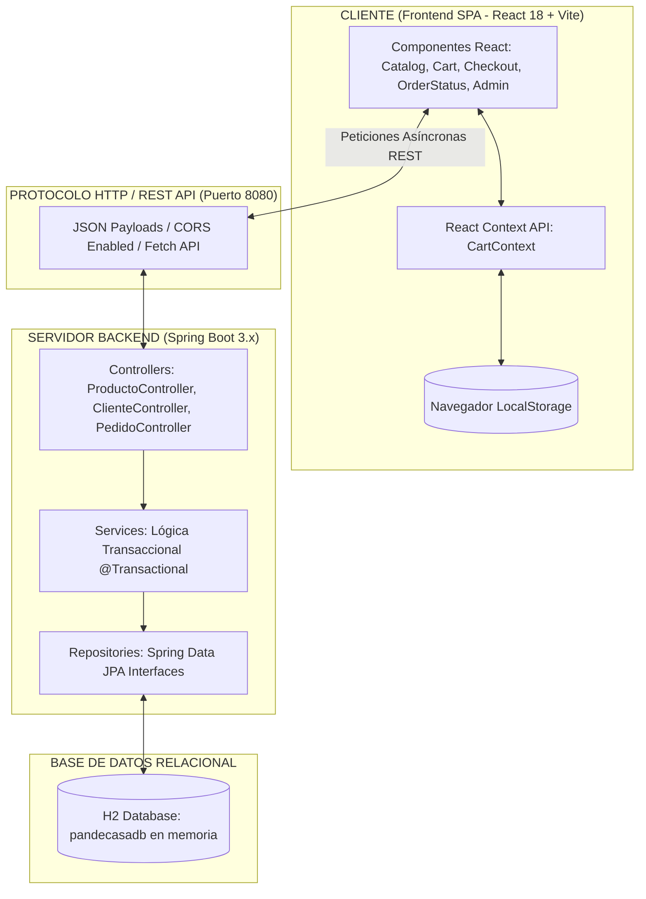
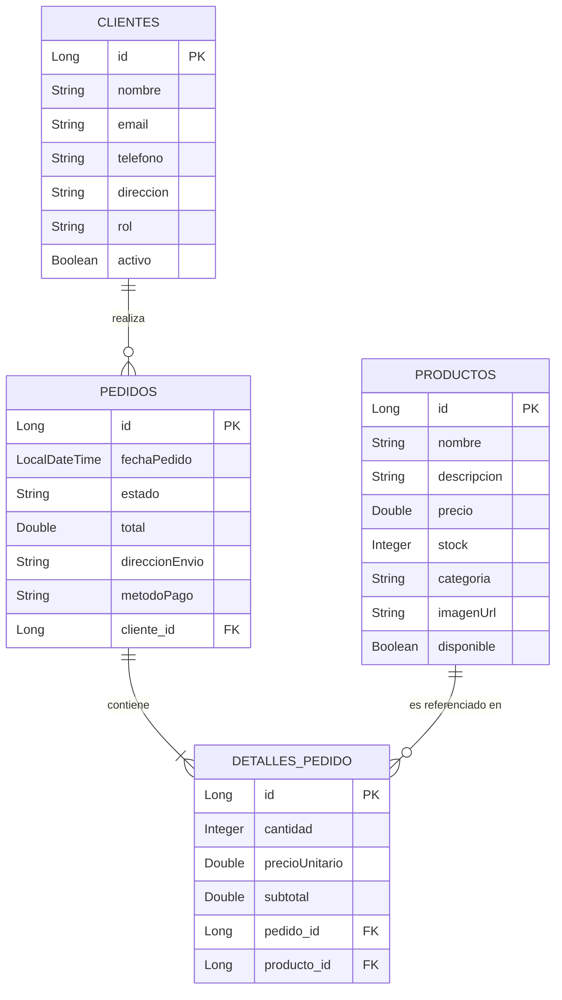
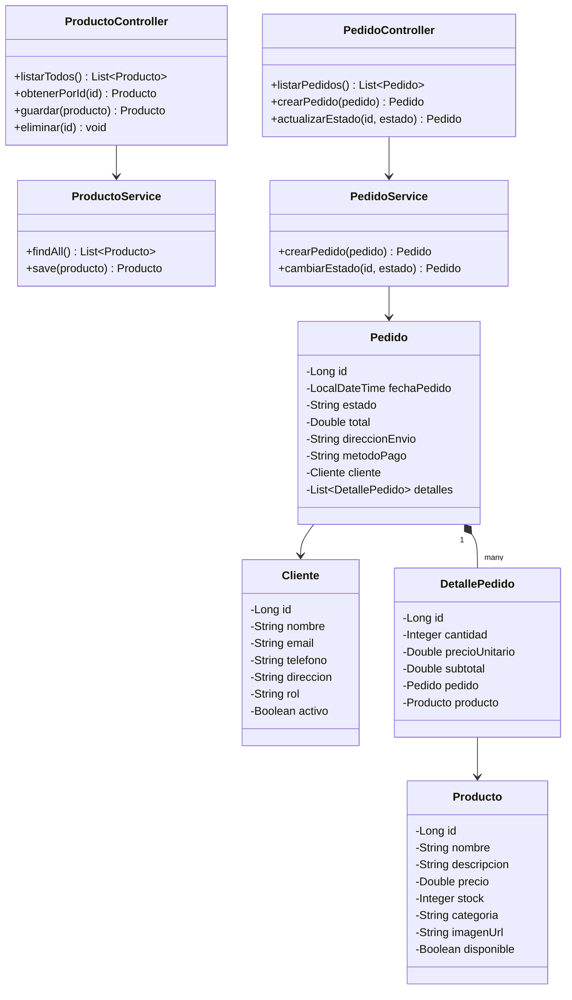
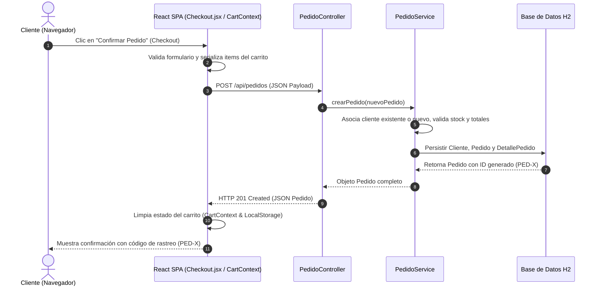

# 🥐 Pan de Casa — Sistema Web de Comercio Electrónico y Gestión Artesanal


> Sistema web integral de comercio electrónico, gestión de catálogo y procesamiento de pedidos para la panadería artesanal **"Pan de Casa"**, desarrollado en el marco del programa **Análisis y Desarrollo de Software (ADSO) - SENA**.

---

## 📋 Tabla de Contenidos

1. [Descripción General](#-descripción-general)
2. [Funcionalidades Principales](#-funcionalidades-principales)
   - [Portal de Clientes (E-Commerce)](#-portal-de-clientes-e-commerce)
   - [Panel de Administración](#-panel-de-administración-admin)
   - [Backend & API RESTful](#-backend--api-restful)
3. [Temáticas y Tecnologías (Tech Stack)](#-temáticas-y-tecnologías-tech-stack)
   - [Estándares y Normativa Aplicada](#-estándares-y-normativa-aplicada)
4. [Esquemas y Diagramas Arquitectónicos](#-esquemas-y-diagramas-arquitectónicos)
   - [Arquitectura del Sistema](#1-arquitectura-del-sistema)
   - [Diagrama Entidad-Relación (DER)](#2-diagrama-entidad-relación-der)
   - [Diagrama de Clases (Backend)](#3-diagrama-de-clases-backend)
   - [Diagrama de Secuencia (Flujo de Compra)](#4-diagrama-de-secuencia-flujo-de-compra)
5. [Pasos para su Uso e Instalación](#-pasos-para-su-uso-e-instalación)
   - [Prerrequisitos](#1-prerrequisitos)
   - [Arranque Rápido con un solo Clic](#2-arranque-rápido-con-un-solo-clic-recomendado)
   - [Puesta en Marcha Manual del Backend y Frontend](#3-puesta-en-marcha-manual)
   - [Acceso a la Consola H2 Database](#4-acceso-a-la-consola-de-base-de-datos-h2)
   - [Credenciales de Administración](#5-credenciales-de-administración-demo)
6. [Tabla de Endpoints de la API REST](#-tabla-de-endpoints-de-la-api-rest)
7. [Estructura del Proyecto](#-estructura-del-proyecto)
8. [Información Académica y Licencia](#-información-académica-y-licencia)

---

## 🌟 Descripción General

**Pan de Casa** es una solución tecnológica web diseñada para digitalizar la experiencia comercial y operativa de una panadería artesanal. El proyecto adopta una arquitectura moderna desacoplada compuesta por:
- **Frontend SPA (Single Page Application):** Desarrollado con **React 18 + Vite**, gestión de estado global mediante React Context API (`CartContext`), diseño modular responsivo con catálogo dinámico de 4 columnas, y enrutamiento con `react-router-dom`.
- **Backend Empresarial:** Construido en **Java 17 con Spring Boot 3.x**, arquitectura por capas (Controladores REST, Servicios transaccionales `@Transactional`, Repositorios Spring Data JPA y validación Bean Validation).
- **Capa de Persistencia:** Base de datos relacional **H2 en memoria** de alta velocidad, autogestionada con Hibernate ORM y sembrado de datos automático (`DataSeeder.java`).
*(Nota histórica: El prototipo preliminar estático en HTML5/Vanilla JS se preserva archivado en la carpeta `backup_old_site/`).*

El sistema permite a los clientes explorar el catálogo de panadería en tiempo real, armar su carrito de compras de manera reactiva, realizar pedidos con confirmación inmediata y consultar el avance de su orden mediante un rastreador en tiempo real con línea de progreso gráfica (`/order-status`). Para el personal de la panadería, incluye un panel de control administrativo protegido (`/admin`) para gestión integral de catálogo (CRUD) y actualización del ciclo de vida de los pedidos.

---

## ⚡ Funcionalidades Principales

### 🛒 Portal de Clientes (E-Commerce)
- **Catálogo Interactivo y Filtrado:** Visualización de productos en cuadrícula de 4 columnas en escritorio, con filtros por categoría (Panes, Repostería, Bebidas), stock disponible, precios e imágenes.
- **Carrito de Compras Reactivo:** Estado global administrado con React Context y persistencia en `localStorage`, actualización en vivo de cantidades, subtotales y total general.
- **Formulario de Checkout Idempotente:** Captura estructurada de datos del cliente (nombre, email, teléfono, dirección y método de pago), con asociación automática de clientes recurrentes para evitar errores de duplicidad.
- **Recibo Digital y Confirmación:** Asignación de código correlativo de seguimiento de pedido (`PED-X`).
- **Rastreador de Pedidos con Stepper Gráfico:** Módulo interactivo en `/order-status` que muestra en 4 fases gráficas el avance del pedido (*Recibido*, *En Horno*, *En Camino*, *Entregado*).

### 🛡️ Panel de Administración (`/admin`)
- **Autenticación Protegida:** Control de acceso administrativo con clave (`admin123`).
- **Dashboard Operativo:** Resumen ejecutivo con métricas de ventas, pedidos activos y productos en inventario.
- **Gestión CRUD de Catálogo:** Creación, edición de stock/precios y borrado de productos directamente conectados a la API REST.
- **Gestión de Pedidos en Vivo:** Cambio de estados de órdenes con impacto instantáneo y bidireccional en el rastreador de clientes.

### ⚙️ Backend & API RESTful
- **Arquitectura N-Capas:** Controladores REST, Servicios Transaccionales `@Transactional`, Repositorios `Spring Data JPA` y Entidades Hibernate.
- **Data Seeding Automatizado:** Carga inicial automática de productos demo al iniciar el servidor mediante `DataSeeder.java`.
- **Habilitación de CORS Configurada:** Permite la comunicación asíncrona mediante `Fetch API` / Axios desde cualquier cliente web.
- **Persistencia Relacional:** Tablas SQL normalizadas (`productos`, `clientes`, `pedidos`, `detalles_pedido`) autogeneradas por Hibernate.

---

## 🛠️ Temáticas y Tecnologías (Tech Stack)

| Capa / Módulo | Tecnología / Herramienta | Descripción / Rol |
| :--- | :--- | :--- |
| **Frontend UI** | React 18 + Vite | Interfaz de usuario basada en componentes SPA rápidos y modulares. |
| **Frontend State & Router** | Context API + React Router DOM v6 | Gestión global del carrito y enrutamiento dinámico en el navegador. |
| **Backend Runtime** | Java 17 LTS (OpenJDK) | Entorno de ejecución robusto y fuertemente tipado. |
| **Framework Backend** | Spring Boot 3.x (Spring Web, JPA) | Framework empresarial para construcción de microservicios RESTful. |
| **ORM / Persistencia** | Hibernate / Spring Data JPA | Abstracción Objeto-Relacional y ejecución de consultas relacionales. |
| **Motor de BD** | H2 Database Engine (Memoria) | Motor SQL liviano con consola de gestión web en `/h2-console`. |
| **Gestor de Dependencias** | Maven (Backend) + npm (Frontend) | Gestión automatizada de librerías y ciclo de vida de compilación. |
| **Calidad de Código** | ESLint + Bean Validation (JSR-380) | Validación de integridad en cliente y validación de entidades en backend. |

### 📜 Estándares y Normativa Aplicada
- **ISO/IEC/IEEE 12207:** Modelo del ciclo de vida del software (Procesos principales, de soporte y de organización).
- **ISO/IEC 25000 (SQuaRE):** Calidad de producto de software (Evaluación de Rendimiento, Mantenibilidad, Usabilidad y Seguridad).
- **ISO/IEC 27001:** Políticas de seguridad de información, gestión de credenciales y validaciones de entrada.
- **ITIL v4:** Gestión de servicios de TI, catálogo de servicios y flujo transaccional de solicitudes de cambio/pedidos.

---

## 📊 Esquemas y Diagramas Arquitectónicos

### 1. Arquitectura del Sistema



---

### 2. Diagrama Entidad-Relación (DER)



---

### 3. Diagrama de Clases (Backend)



---

### 4. Diagrama de Secuencia (Flujo de Compra)



---

## 🚀 Pasos para su Uso e Instalación

### 1. Prerrequisitos
Asegúrese de contar con las siguientes herramientas en su entorno:
- **Java Development Kit (JDK):** Versión 17 o superior (`java -version`).
- **Node.js y npm:** Versión 18+ (`node -v` y `npm -v`).
- **Apache Maven:** Versión 3.8+ (opcional, el backend incluye wrapper o scripts automáticos).
- **Navegador Web Moderno:** Google Chrome, Edge, Firefox o Brave.

---

### 2. Arranque Rápido con un solo Clic (Recomendado)

En la raíz del proyecto encontrará scripts automatizados listos para Windows:
1. Haga doble clic sobre **`arrancar_todo.bat`**.
2. El script abrirá dos ventanas de consola:
   - **Terminal 1 (Backend):** Servidor Spring Boot en **`http://localhost:8080`**.
   - **Terminal 2 (Frontend):** Servidor de desarrollo Vite (React) en **`http://localhost:5173`**.
3. Ingrese desde su navegador a **`http://localhost:5173`** para usar la tienda.

---

### 3. Puesta en Marcha Manual

Si desea ejecutar los servicios de forma individual por terminal:

#### 🔹 Terminal 1 — Backend (Spring Boot 3.x)
```bash
cd backend
mvn spring-boot:run
```
*El servidor confirmará su inicio con `Started PanDeCasaApplication in X.XXX seconds` en `http://localhost:8080`.*

#### 🔹 Terminal 2 — Frontend (React 18 + Vite)
```bash
cd frontend
npm install
npm run dev
```
*La consola indicará el acceso local en `http://localhost:5173`.*

---

### 4. Acceso a la Consola de Base de Datos H2

Para auditar las tablas SQL y registros relacionales en vivo:
1. Ingrese en el navegador a: **`http://localhost:8080/h2-console`**
2. Ingrese los parámetros de conexión:
   - **Driver Class:** `org.h2.Driver`
   - **JDBC URL:** `jdbc:h2:mem:pandecasadb` *(⚠️ Reemplazar la URL por defecto)*
   - **User Name:** `sa`
   - **Password:** `password`
3. Haga clic en **"Connect"** para abrir el editor SQL y consultar las tablas: `PRODUCTOS`, `CLIENTES`, `PEDIDOS` y `DETALLES_PEDIDO`.

---

### 5. Credenciales de Administración (Demo)

Para acceder al Panel Administrativo (`http://localhost:5173/admin`):
- **Contraseña:** `admin123`

---

## 🔗 Tabla de Endpoints de la API REST

| Método | Endpoint | Descripción | Payload / Parámetros |
| :--- | :--- | :--- | :--- |
| `GET` | `/api/productos` | Obtiene el catálogo completo de productos | Ninguno |
| `GET` | `/api/productos/{id}` | Obtiene un producto por su ID | ID en URL |
| `POST` | `/api/productos` | Registra un nuevo producto en el catálogo | JSON `Producto` |
| `PUT` | `/api/productos/{id}` | Actualiza un producto existente | JSON `Producto` |
| `DELETE` | `/api/productos/{id}` | Elimina un producto descatalogado | ID en URL |
| `GET` | `/api/pedidos` | Obtiene el listado global de pedidos recibidos | Ninguno |
| `GET` | `/api/pedidos/{id}` | Obtiene el detalle de un pedido por ID | ID en URL |
| `POST` | `/api/pedidos` | Registra un nuevo pedido con cliente y detalles | JSON `Pedido` |
| `PUT` | `/api/pedidos/{id}/estado` | Actualiza el estado operativo de un pedido | Query Param `estado` |

---

## 📈 Evolución y Mejoras Aplicadas (Hitos del Proyecto)

1. **Despliegue de Arquitectura Backend (Spring Boot 3.x):** Transición de prototipo volátil a arquitectura Cliente-Servidor robusta. API RESTful con persistencia transaccional en H2 Database utilizando Spring Data JPA e Hibernate.
2. **Modernización de Frontend (React 18 + Vite SPA):** Evolución hacia una Single Page Application moderna con cuadrícula responsiva de 4 columnas, React Router DOM, y gestión de estado reactiva con React Context API (`CartContext`).
3. **Idempotencia y Resiliencia en Checkout:** Asociación transparente de compras repetidas por correo electrónico, garantizando transacciones fluidas y evitando errores de duplicidad de clave única.
4. **Seguimiento Gráfico de Pedidos:** Implementación del rastreador interactivo en `/order-status` con código correlativo `PED-X` y línea de avance en 4 etapas (*Recibido*, *En Horno*, *En Camino*, *Entregado*).
5. **Aseguramiento de Calidad y Cumplimiento Normativo:** Estándares ISO/IEC/IEEE 12207, ISO/IEC 25000 (SQuaRE) e ITIL v4 implementados y auditados en toda la documentación técnica.

---

## 📁 Estructura del Proyecto

```text
PAN DE CASA PROYECTO 2/
├── arrancar_todo.bat          # Script de arranque simultáneo (Backend + Frontend)
├── arrancar_backend_magico.bat# Script de arranque automatizado del Backend
├── GUIA_PUESTA_EN_MARCHA.md   # Guía paso a paso ilustrada de puesta en marcha
├── README.md                  # Documentación técnica principal del proyecto
├── frontend/                  # Aplicación Cliente SPA (React 18 + Vite)
│   ├── src/
│   │   ├── components/        # Header, AdminSidebar, ProductCard
│   │   ├── context/           # CartContext.jsx (Estado global del carrito)
│   │   ├── pages/             # Catalog.jsx, Cart.jsx, Checkout.jsx, OrderStatus.jsx
│   │   │   └── admin/         # Login, Dashboard, ProductManagement, ActiveOrders
│   │   ├── App.jsx            # Enrutador principal de la aplicación SPA
│   │   ├── index.css          # Estilos visuales cálidos de panadería artesanal
│   │   └── main.jsx           # Punto de entrada de React
│   ├── package.json           # Dependencias npm (react, react-router-dom, vite)
│   └── vite.config.js         # Configuración del servidor de desarrollo Vite
├── backend/                   # Servidor API REST (Java 17 + Spring Boot 3.x)
│   ├── src/main/java/com/pandecasa/backend/
│   │   ├── config/            # WebConfig (CORS) y DataSeeder (Sembrado inicial)
│   │   ├── controller/        # ProductoController, ClienteController, PedidoController
│   │   ├── model/             # Entidades JPA: Producto, Cliente, Pedido, DetallePedido
│   │   ├── repository/        # Repositorios Spring Data JPA (CRUD)
│   │   └── service/           # Capa de servicios y transaccionalidad @Transactional
│   ├── src/main/resources/    # application.properties (H2 en memoria, Mailtrap, JPA)
│   ├── postman/               # Colección de pruebas REST para Postman
│   └── pom.xml                # Configuración de dependencias Maven
├── docs/                      # Documentación académica y técnica formal
│   ├── DOCUMENTO_ACADEMICO_PROYECTO.md  # Informe formal del proyecto (ADSO SENA)
│   ├── GUIA_GRABACION_VIDEO.md          # Guion escena por escena para video de evidencia
│   ├── REGISTRO_CAMBIOS.md              # Bitácora de cambios bajo normas ISO / ITIL
│   └── SOLUCION_CONEXION_H2.txt         # Solución a errores de conexión en H2 Console
└── backup_old_site/           # Archivo histórico del prototipo inicial estático HTML5/JS
```

---

## 🎓 Información Académica y Licencia

- **Institución:** Servicio Nacional de Aprendizaje (SENA)
- **Programa:** Tecnólogo en Análisis y Desarrollo de Software (ADSO)
- **Centro de Formación:** SENA Colombia
- **Fecha:** Julio 2026
- **Licencia:** Este proyecto está distribuido bajo la licencia [ISC](LICENSE). Uso académico e investigativo.

---
<div align="center">
  <sub>Desarrollado para la transformación digital del sector panadero artesanal · SENA ADSO 2026</sub>
</div>
