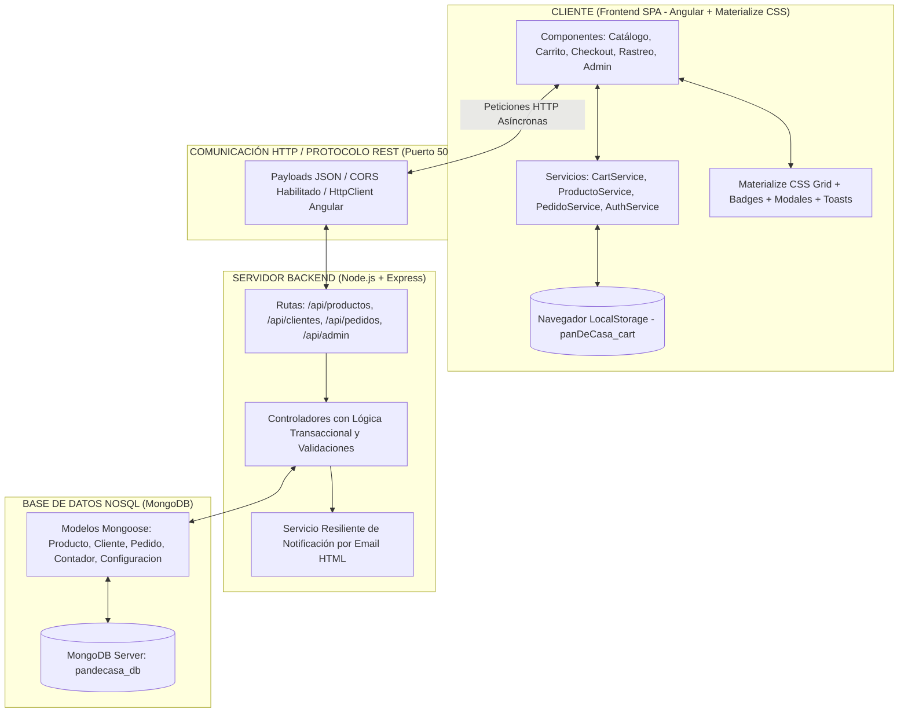

# 🥐 Pan de Casa — Sistema Web Artesanal con MEAN Stack y Materialize CSS


> Sistema web integral de comercio electrónico y gestión operativa para la panadería artesanal **"Pan de Casa"**, desarrollado en el marco del programa **Análisis y Desarrollo de Software (ADSO) - SENA**, implementando una arquitectura moderna basada en la pila **MEAN** (**M**ongoDB, **E**xpress, **A**ngular, **N**ode.js) y el framework de diseño **Materialize CSS**.

---

## 📋 Tabla de Contenidos
1. [Descripción General](#-descripción-general)
2. [Arquitectura Tecnológica (MEAN Stack)](#-arquitectura-tecnológica-mean-stack)
3. [Funcionalidades Principales](#-funcionalidades-principales)
   - [Portal de Clientes (E-Commerce)](#-portal-de-clientes-e-commerce)
   - [Panel de Administración Operativo](#-panel-de-administración-operativo)
4. [Estructura del Proyecto](#-estructura-del-proyecto)
5. [Instalación y Puesta en Marcha](#-instalación-y-puesta-en-marcha)
   - [Arranque con un solo clic](#1-arranque-rápido-con-un-solo-clic-recomendado)
   - [Arranque manual por terminal](#2-arranque-manual-por-terminal)
6. [Tabla de Endpoints de la API REST](#-tabla-de-endpoints-de-la-api-rest)
7. [Credenciales Demo](#-credenciales-demo)

---

## 🌟 Descripción General

**Pan de Casa** es una solución digital desacoplada que transforma los procesos comerciales y de cocina de una panadería artesanal:
- **Frontend SPA (Single Page Application):** Desarrollado en **Angular** con diseño artesanal cálido (*Warm Terracotta Palette*), componentes y grillas responsivas de **Materialize CSS**, tipografía **Work Sans**, e íconos **Material Icons**. Gestión de estado reactiva mediante **Angular Signals** y persistencia en `localStorage`.
- **Backend API RESTful:** Construido en **Node.js con Express**, arquitectura por capas (Controladores, Modelos, Enrutadores, Servicios de Notificación por Email HTML resilientes y utilidades de sembrado inicial).
- **Persistencia NoSQL:** Motor de base de datos **MongoDB** con esquemas tipados y validados mediante **Mongoose**, transaccionalidad atómica para deducción de stock y secuencias numéricas correlativas para códigos amigables (`PED-X`).

---

## 🏗️ Arquitectura Tecnológica (MEAN Stack)



---

## ⚡ Funcionalidades Principales

### 🛒 Portal de Clientes (E-Commerce)
- **Catálogo Interactivo con Vista Dual (`/`):** Alternador entre vista cuadrícula y vista lista, filtros dinámicos por categorías (*Panes*, *Amasijos*, *Repostería*, *Todos*), imágenes con carga resiliente y precios en Pesos Colombianos (`COP`).
- **Control de Cantidad Integrado en Tarjeta:** Stepper reactivo tipo pastilla `[-] N [+]` integrado directamente en la tarjeta del producto si ya fue agregado.
- **Carrito de Compras Reactivo (`/cart`):** Gestión en vivo con Signals y `localStorage`, vista a dos columnas con miniaturas, selector de cantidades, botón de vaciado y resumen de costos.
- **Checkout Idempotente (`/checkout`):** Registro o vinculación automática de cliente por correo electrónico, formulario de despacho y notas, generación de código correlativo `PED-{id}`.
- **Rastreador Gráfico en Tiempo Real (`/order-status`):** Stepper visual interactivo de 4 etapas (*Recibido*, *En Horno*, *En Camino*, *Entregado*) o banner de anulación si el pedido fue cancelado. Búsqueda flexible (`PED-5`, `ped-5` o solo `5`).

### 🛡️ Panel de Administración Operativo
- **Acceso Protegido (`/admin`):** Validación de clave maestra protegida por `AuthGuard`.
- **Dashboard Operativo y KPIs (`/admin/dashboard`):** Métricas en vivo de ventas monetarias totales, pedidos totales y pedidos pendientes de despacho.
- **Plan de Producción en Cocina ("A Hornear"):** Tabla consolidada en tiempo real de las unidades de panadería que la cocina debe producir para abastecer las órdenes en proceso.
- **Gestión CRUD de Catálogo (`/admin/products`):** Creación y edición con modal emergente, previsualización de imágenes en vivo, control de existencias mínimas y eliminación confirmada.
- **Gestión de Pedidos en Vivo (`/admin/orders`):** Lista ordenada cronológicamente de pedidos con datos del cliente y lista de ítems, badge semántico de estado y selector desplegable para cambio inmediato de etapa.
- **Notificación por Correo Electrónico:** Envío automático de correo con diseño corporativo HTML al cliente al actualizar el estado de su orden.
- **Cambio de Contraseña (`/admin/password`):** Módulo administrativo para actualizar la clave de acceso.

---

## 📁 Estructura del Proyecto

```text
PAN DE CASA MONGODB/
├── arrancar_todo.bat          # Script de arranque simultáneo (Backend + Frontend)
├── arrancar_backend.bat       # Script de arranque del servidor Node.js + Express
├── arrancar_frontend.bat      # Script de arranque del servidor Angular
├── README.md                  # Documentación técnica completa
├── backend/                   # Servidor API REST (Node.js + Express + MongoDB)
│   ├── src/
│   │   ├── config/
│   │   │   └── db.js          # Conexión Mongoose a MongoDB local
│   │   ├── controllers/       # Lógica transaccional de productos, pedidos, clientes y admin
│   │   ├── models/            # Esquemas Mongoose: Producto, Cliente, Pedido, Contador, Configuracion
│   │   ├── routes/            # Enrutadores Express (/api/productos, /api/pedidos, etc.)
│   │   ├── services/          # emailService.js (Notificaciones HTML corporativas)
│   │   ├── utils/             # seedData.js (Carga automática de catálogo inicial)
│   │   └── server.js          # Servidor principal Express con CORS
│   └── package.json           # Dependencias (express, mongoose, cors, nodemailer, dotenv)
└── frontend/                  # Aplicación SPA (Angular 18+ & Materialize CSS)
    ├── src/
    │   ├── app/
    │   │   ├── components/    # HeaderComponent, AdminSidebarComponent
    │   │   ├── guards/        # authGuard.ts (Protección de rutas /admin/*)
    │   │   ├── models/        # Interfaces TypeScript: Producto, Pedido, Cliente, CartItem
    │   │   ├── pages/         # Catalog, Cart, Checkout, OrderStatus
    │   │   │   └── admin/     # Login, Dashboard, Products, Orders, Password
    │   │   ├── services/      # CartService (Signals), ProductoService, PedidoService, AuthService
    │   │   ├── app.routes.ts  # Configuración del enrutador SPA
    │   │   └── app.ts         # Componente raíz
    │   ├── styles.css         # Tokens de diseño artesanal y adaptaciones de Materialize CSS
    │   └── index.html         # Fuentes Work Sans y Material Icons
    ├── angular.json           # Configuración Angular con Materialize CSS y JS
    └── package.json           # Dependencias de Angular y materialize-css
```

---

## 🚀 Instalación y Puesta en Marcha

### Prerrequisitos
- **Node.js:** Versión 18 o superior (`node -v`).
- **MongoDB:** Servicio local de MongoDB en ejecución en el puerto por defecto `27017` (`mongodb://127.0.0.1:27017/pandecasa_db`).

---

### 1. Arranque Rápido con un solo Clic (Recomendado)

En la raíz del proyecto, simplemente haz doble clic en el archivo:
```text
arrancar_todo.bat
```
El script iniciará el backend en el puerto **5000** y el frontend Angular en el puerto **4200**, abriendo tu navegador automáticamente.

---

### 2. Arranque Manual por Terminal

Si deseas ejecutar los servicios de forma individual:

#### 🔹 Terminal 1 — Backend (Node.js + Express + MongoDB)
```bash
cd backend
npm install
npm start
```
*El servidor confirmará su inicio en `http://localhost:5000` con conexión a `pandecasa_db`.*

#### 🔹 Terminal 2 — Frontend (Angular + Materialize CSS)
```bash
cd frontend
npm install
npx ng serve --open
```
*La aplicación SPA estará disponible en `http://localhost:4200`.*

---

## 🔗 Tabla de Endpoints de la API REST

| Método | Endpoint | Descripción | Parámetros / Body |
| :--- | :--- | :--- | :--- |
| `GET` | `/api/productos` | Obtiene el catálogo de productos | Ninguno |
| `GET` | `/api/productos/:id` | Consulta un producto por su ID | ID numérico o ObjectId |
| `POST` | `/api/productos` | Registra un nuevo producto | JSON con `nombre`, `precio`, `stock`, etc. |
| `PUT` | `/api/productos/:id` | Modifica un producto existente | JSON con datos actualizados |
| `DELETE` | `/api/productos/:id` | Elimina un producto | ID en URL |
| `POST` | `/api/clientes` | Registro o búsqueda idempotente | JSON con `email`, `nombre`, etc. |
| `GET` | `/api/pedidos` | Lista todos los pedidos recibidos | Ninguno |
| `GET` | `/api/pedidos/:id` | Consulta rastreo de orden | Código `PED-X` o ID en URL |
| `POST` | `/api/pedidos` | Crea pedido y descuenta stock | JSON con cliente, dirección y detalles |
| `PUT` | `/api/pedidos/:id/estado` | Actualiza estado y notifica | Query param `?nuevoEstado=ESTADO` |
| `POST` | `/api/admin/login` | Autenticación administrativa | JSON `{ password }` |
| `GET` | `/api/admin/metricas` | KPIs y tabla "A Hornear" | Ninguno |
| `PUT` | `/api/admin/password` | Actualización de contraseña | JSON `{ passwordActual, nuevaPassword }` |

---

## 🔑 Credenciales Demo

Para ingresar a la consola administrativa (`http://localhost:4200/admin`):
- **Contraseña:** `admin123`

---

<div align="center">
  <sub>Desarrollado para el fortalecimiento del sector panadero artesanal · SENA ADSO 2026</sub>
</div>
